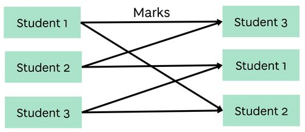
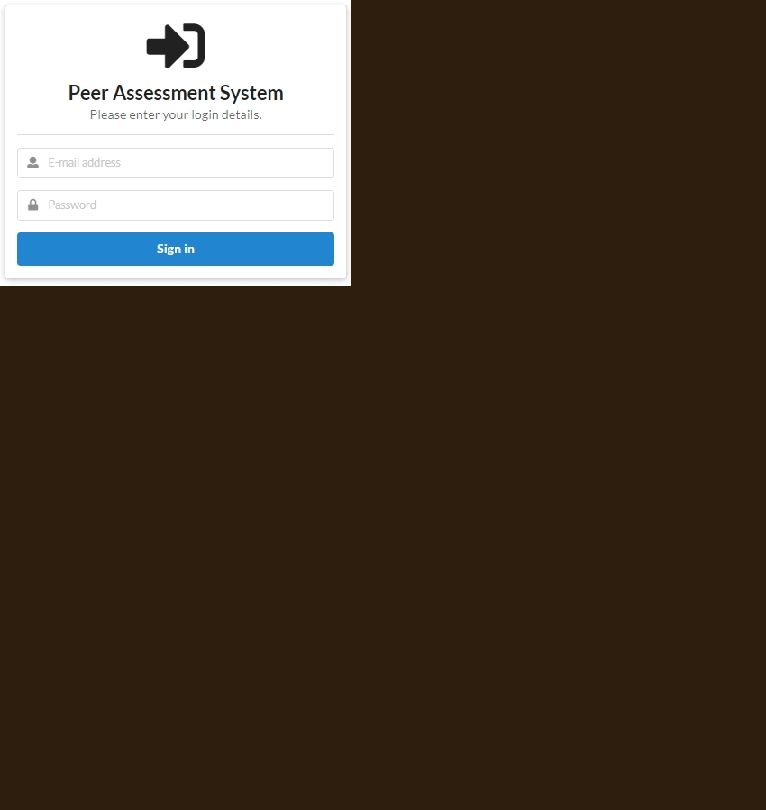

### What is this about?
Peer Assessment is a great tool to improve a student’s knowledge on a given topic. Students mark their peers and give feedback on their performance as opposed to lecturers marking all the students.

However, it takes a lot of time and effort for lecturers to set up peer assessment for the whole class effectively. Therefore, a system was created in the form of a web application to handle the following:
- Allow lecturers/teachers to create assessments and distribute them to students in a class.
- Gather answers from students.
- Randomly assign students to mark their peers.
- Facilitate peer marking to gather marks and feedback from student markers.

---

### What can the system do?

There are three types of users: Adminstrator (admin), teacher and student.

- **Admins** can
  - Create users and view list of users.
  - Create classes and view list of classes.
- **Teachers** can
  - Create assessments for a class.
    - Add assessment questions.
    - Add marking criteria/questions to each assessment question.
  - Manage assessments.
    - View a student's answers and feedback.
    - Give feedback and marks on a student's answer.
    - See which student has completed the assessment and marking.
    - Begin/End assessment and marking to prevent access and late submissions.
- **Students** can
  - View details about the assessments.
  - Answer the assessment questions.
  - Mark their peers and give feedback.
  - View feedback from their peers and teacher.

*To prevent spam and abuse, credentials are required to login to the system. Please email [a.c.baretto@dundee.ac.uk](mailto:a.c.baretto@dundee.ac.uk?subject:Can I see your peer assessment system?") to request access.*

  <button type="button" id="btnOpenSystem" class="btn btn-primary" onClick="openSystem()">Web application</button>
  

    <button id="btnDropdownExtraLinks" type="button" class="btn btn-outline-primary dropdown-toggle" data-bs-toggle="dropdown" aria-haspopup="true" aria-expanded="false"></button>
    

      <a class="dropdown-item" href="https://github.com/FreetimeFM/peer-assessment" target="_blank">Source Code</a>
    

  

---

### How did you make it?
The web application was built with <a href="https://nextjs.org/" target="_blank">Next.js</a>, a full stack JavaScript framework built on top of <a href="https://reactjs.org/" target="_blank">React</a>. Components from the <a href="https://react.semantic-ui.com/" target="_blank">Semantic UI React</a> library were used in the design and <a href="https://fauna.com/" target="_blank">Fauna</a> as the database.

---

### Do you have any screenshots?
Here is a slideshow that shows 5 screenshots:
1. Login prompt.
2. What students will see when they answer the assessment.
3. What students will see when they mark their peers.
4. Assessment dashboard for teachers.
5. Results overview for teachers.

To see more, please email [a.c.baretto@dundee.ac.uk](mailto:a.c.baretto@dundee.ac.uk?subject:Can I see your peer assessment system?").

