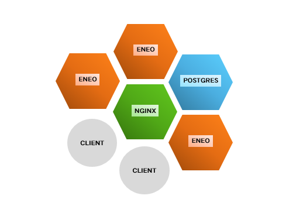

#### Overview
A minimal matrix homeserver was written in Erlang with an emphasis on scalability. It has basic support for message sending and user authentication. Moreover, it can run on a cluster of physically separated computers.

#### Matrix
- [matrix](https://matrix.org) is a standard for open, secure, decentralized and federated real-time communication.
- Matrix has the potential to become the industry standard for instant messaging, gradually replacing e-mail. Federation makes this possible, allowing organisations and individuals to interact with one another regardless of provider, client application, or server software used.
- used by the french government, in the healthcare sector, banking and by individuals.

#### Implementation
- implemented in Erlang/OTP, a functional programming language designed for scalable, soft real-time systems.
- the following features of the matrix [client-server API](https://matrix.org/docs/spec/client_server/latest), a json REST API, were implemented:
	- getting a single event
	- getting events for a room with basic filter support
	- sending a message event to a room
	- authenticating existing users using access tokens
- Tested with docker containers, deployed to a cluster of raspberry pis.
- A client connects to a load balancer (nginx), which then routes traffic to eneo containers. They handle http requests, update the database (postgreSQL) accordingly, and send a reply back.
- source code available [here](https://github.com/bkopplin/honours).

