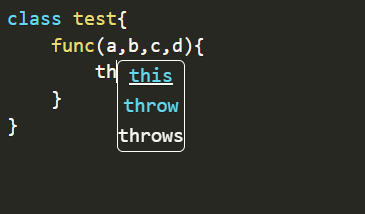
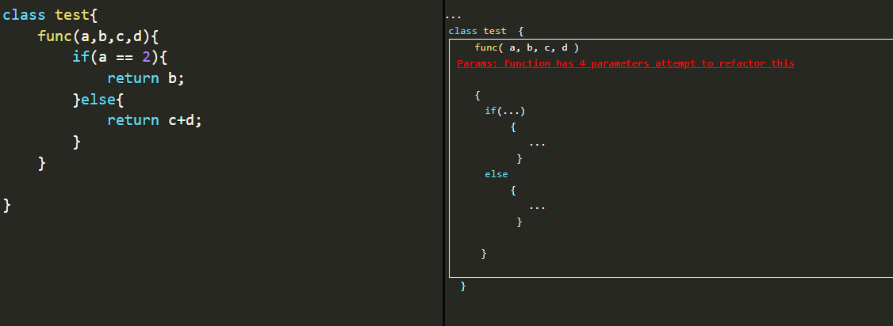

## Project Description
Writing quality code is not only one of the most important skills a developer can learn, ensuring that code is high quality is key to ensuring the success of a development organisation. 

The aim of this project is to create a tool to generate code quality metrics by performing static code quality analysis.

## Technologies 

Many technologies were utilised throughout the project...

### Frontend

- [React.js](https://reactjs.org/)
- [Prism.js](https://prismjs.com/)

    The frontend of the application is a React.js static web application utilising Prism.js for syntax highlighting.

### Backend

- [Node.js](https://nodejs.org/en/)
- [Express.js](https://expressjs.com/)

    The backend of the application is a Node.js app using Express.js to serve api requests and the static React.js files.

### Testing

- [Jest](https://jestjs.io/)

    Testing and testing coverage collection is performed using Jest.

### Docs

- [JSDoc](https://jsdoc.app/)

    Source code is commented to the JSDoc standard to extract and generate documentation.

### Deployment
- [Heroku](https://www.heroku.com/)
    
    Heroku was used as the deployment platform for creating artifacts to be tested by users.

## Project Findings

The final created artifact is a web application that allows the user to edit source code with IDE tools such as auto-complete and auto-fill. 

Analysis is performed on the source code in the form of:

Syntactical Analysis Does the code fit the syntax of the language.

Code Smells A generalised term for problem parts of code that don’t break syntax e.g. too many parameters in a function.

Complexity Analysis How complex is a function, how many tests will it take to ensure a function is fully tested.

This analysis is then displayed to the user within the application.

## Project Media

</img>
</img>

