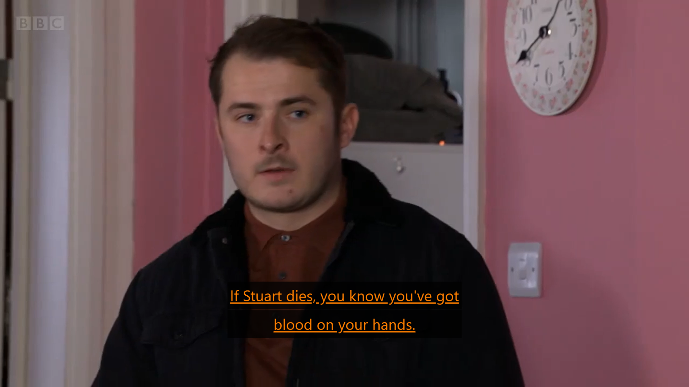
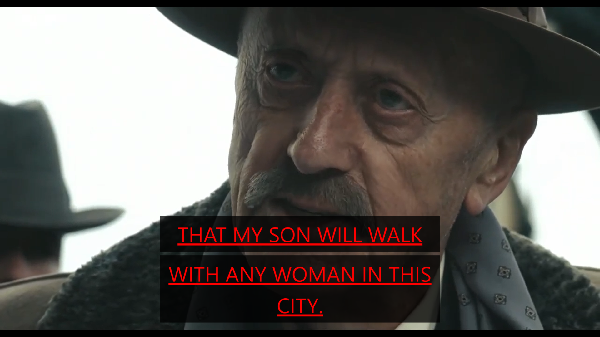

## Project Description
Subtitles are text that accompanies audio and video content and is used as a way to visually display the commentary and dialogue present in the audio track. They are good at explaining what is being said but do not convey information on how they are said. Emotional information such as intonation or irony that help the viewer understand the deeper meaning of what was said is oftentimes lost when converted to the text display.

In this paper, we have researched people's associations between emotions and various alterations of how the text is presented, created a system that displays subtitles annotated with different emotional categories, and analysed people's responses to videos displayed in the system to gauge the effectiveness of trying to convey emotion in subtitles.

## Project Findings
Results show that compared to traditional subtitle display, enhanced subtitles are better at expressing emotions as well as increase engagement, attention, and usability but received a mixed response in terms of endurability. Enhanced subtitles stand firmly in-between media with traditional subtitles and audible media with regard to effectiveness in expressing emotions and is a potential method of reducing the "emotional gap" for people who rely solely on subtitles to understand audible information.

## Examples
  
